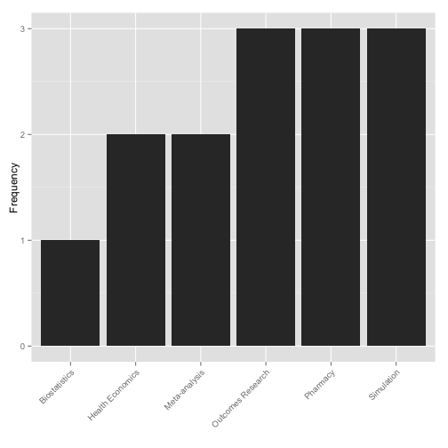
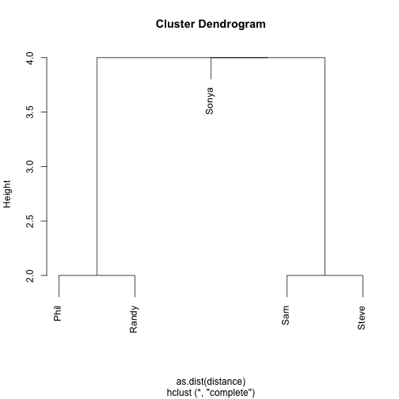

## Pharmerit

There are 5 people attending today. 

Hello Sam, Sonya, Phil, Randy, Steve

The dataset we got is ragged!!

```
## 
## -----------------------------------------------------------
##  Name         V1               V2                V3        
## ------ ---------------- ----------------- -----------------
##  Sam   Health Economics Outcomes Research                  
## 
## Sonya   Biostatistics      Simulation                      
## 
##  Phil   Meta-analysis      Simulation         Pharmacy     
## 
## Randy      Pharmacy       Meta-analysis   Outcomes Research
## 
## Steve  Health Economics Outcomes Research     Pharmacy     
## -----------------------------------------------------------
## 
## Table: Table continues below
## 
##  
## ----------
##     V4    
## ----------
##           
## 
##           
## 
##           
## 
##           
## 
## Simulation
## ----------
```


---
## Specialities

 


---
## Groups

 


